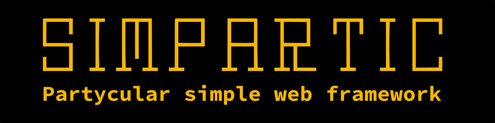

[](https://www.npmjs.com/package/sipa)

[](LICENSE)

> Particularly simple old school single page lightweight web framework for clever javascript developers.

You need to be clever to understand why this framework is that party(cular) you want to have.

But I allow you to use it anyway!

```diff
------------------------------------------
- under heavy development, alpha state. 
------------------------------------------
-
- First beta version including some documentation
- is planned to be released in 01/2022
-
```

**TALBE OF CONTENTS**
* [Why Sipa?](#why-sipa)
    * [Main features](#main-features)
    * [Shipped libraries](#shipped-libraries)
* [Installation](#installation)
* [Setup a new project](#setup-a-new-project)
* [Documentation](#documentation)
* [TODOs](#todos)
* [Contributing](#contributing)


<!-- -------------------------- SECTION -------------------------- -->
<a name="why-sipa"></a>
## Why Sipa?
I just want to develop with Vanilla JS and HTML the old way, I want to directly run and debug the code I code in the browser.
Intensive transpiling (minifying) will happen when creating a production build.

I don't want to learn a new framework world.
I can JavaScript, I want to do JavaScript. I want it simple, I want it stupid easy. So i can add whatever I want if I need to.

... and at the end I want to be happy! :-)


<!-- -------------------------- SECTION -------------------------- -->
<a name="main-features"></a>
### Main features
* Solid basic project structure 
* Simple but powerful page pattern with loader / router 
* Live development web server for JavaScript and SCSS 
* Life cycle with hook feature 
* Internationalization out of the box 
* EJS template engine (optional) 
* Storage to keep state on three different persistence levels 
* Builder to create compressed and minified .js and .css for production 


<!-- -------------------------- SECTION -------------------------- -->
<a name="shipped-libraries"></a>
### Shipped libraries
* `CurlyBracketParser` for url parsing
* `LuckyCase` for name case transformations
* `EJS` for embedded javascript template rendering (optional)
* `jQuery` for having fun easily the old way (optional)


<!-- -------------------------- SECTION -------------------------- -->
<a name="installation"></a>
## Installation
### Prerequisites
[NodeJS](https://nodejs.org/en/download/) >= **13.x** and [Yarn](https://classic.yarnpkg.com/en/docs/install/) **1.x** are installed.
You may use npm instead of yarn.

### Install the framework with yarn
```bash
yarn global add sipa
```

#### Add to PATH environment variable

You have to ensure, that the path of yarns bin directory is added to PATH.

#### Linux/Unix/MacOS

So if the command `sipa` is not available after installation, add the following line to your shell config if you are using linux/macOS/unix (`~/.bashrc`, `~/.zshrc`/...):
```shell
export PATH="$(yarn global bin):$PATH"
```

#### Windows
Run `yarn global bin` and add the PATH to your global PATH environment variable.


### Install the framework with npm
```bash
npm install -g sipa
```

Depending on your global npm directory, you may need to run this command with sudo or as root:
```bash
sudo npm install -g sipa
```

### After installing with yarn or npm

That's it!

The command `sipa` is now available on the command line.

Run `sipa help` for more information.

Or get started with our tutorial [here]() (TODO).


<!-- -------------------------- SECTION -------------------------- -->
<a name="setup-a-new-project"></a>
## Setup a new project
On the commandline run
```bash
sipa new
```
to create a new project as subfolder of the current directory.

A interactive setup assists you and generates the project depending on your input.


<!-- -------------------------- SECTION -------------------------- -->
<a name="documentation"></a>
## Documentation
Check out the doc at ... to be done. ;-)

> Either checking for mark down solution or even a github page. Github page may be generated from mark down sources.

> Check for nice documentation templates

> Check the need and technical options for translations (=> create the doc with the framework itself?)

<!-- -------------------------- SECTION -------------------------- -->
<a name="todos"></a>
## TODOs:
### command line interface
  - [ ] delete task 
  - build task
    - [ ] default build with minified assets 
      - [ ] index.html src *check* before build 
    - [ ] single html file build 
  - update task
    - [ ] update sipa cli installation itself 
    - [ ] update sipa within current project 

### common
- [ ] developer documentation (github page?) 
- [ ] built-in ejs rendering for pages and layouts 
- [ ] built-in translation service 


### other / low prio
  - [ ] test on windows platform 
  - [ ] test on naked linux platform (VM) 
  - [ ] add unit tests 
  - [ ] make EJS and jQuery optional at interactive setup 


<!-- -------------------------- SECTION -------------------------- -->
<a name="contributing"></a>
## Contributing

Bug reports and pull requests are welcome on GitHub at https://github.com/magynhard/sipa. This project is intended to be a safe, welcoming space for collaboration, and contributors are expected to adhere to the [Contributor Covenant](http://contributor-covenant.org) code of conduct.


